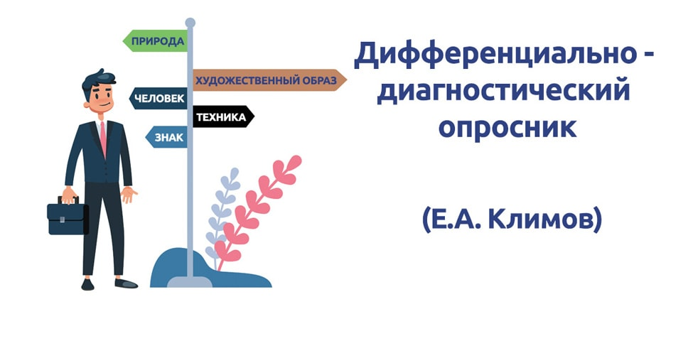

# tg_university_helper

## Это проект созданный для хакатона, Губкинского Кейс-Клуба

## Описание:
**tg_university_helper** - бот для тестирование абитурентов на профориентацию

## Цель:
Разработать текстогого чат-бота, который по средствам психологического тестирования абитуриента и доступа к базе данных конкурса предлагает максимально релевантные направления.

## Задача:
Упростить абитуриентам выбор направления и поступления в универститет!    

## Инструменты:
### aiogram

aiogram — это современная и полностью асинхронная платформа для Telegram Bot API, 
написанная на Python 3.8 с использованием asyncio и aiohttp.

### Дифференциально-диагностический опросник (ДДО) Е.А.Климова

Методика предназначена для выявления склонности (предрасположенности)
человека к определенным типам профессий. Представляет собой достаточно
короткий опросник, состоящий из 20 альтернативных суждений. Испытуемому
необходимо выбрать один из двух, указанных в вопросе, видов занятий. По
результатам обследования, в соответствии с ключом, выявляется ориентация
человека на 5 типов профессий, по классификации Е.А.Климова:
1. человек - природа;
2. человек - техника;
3. человек - человек;
4. человек - знаковая техника, знаковый образ;
5. человек - художественный образ

    Евгений Александрович Климов (1930—2014) - доктор психологических наук,
    профессор, разработчик системно-генетической психофизиологии стиля
    профессиональной деятельности. Наибольшую известность в отечественной
    психологии получила разработанная им классификация профессий по предмету
    труда, которая выделяет пять типов современных профессий: человек – живая
    природа, человек-техника, человек-человек, человек-знаковая система, человек-
    художественный образ.
    Методика предназначена для выявления склонности (предрасположенности)
    старшеклассника к определенным типам профессий. Представляет собой достаточно
    короткий опросник, состоящий из 20 альтернативных суждений.
    Использование методики возможно как индивидуально, так и в группе. Над
    вопросами не следует долго задумываться.

   

##ТЕКСТ ОПРОСНИКА
| Номер | Ответ                                                                                      | Номер | Ответ                      |
|:-----:|:-------------------------------------------------------------------------------------------|-------|----------------------------|
|  a1   | Ухаживать за животными.                                                                    | б1    | Человек - знаковая система |
|  а2   | Помогать больным людям, лечить их                                                          | б2    | 2б                         |
|  a3   | Следить за качеством книжных иллюстраций, плакатов, художественных открыток, грампластинок | б3    | 5а                         |
|  a4   | Обрабатывать материалы (дерево, ткань, пластмассу, металл и т.п.)                          | б4    |                            |
|  a5   | Обсуждать научно-популярные книги, статьи                                                  | б5    |                            |
|  a6   | Выращивать молодняк (животных какой-либо породы)                                           | б6    | 9б                         |
|  a7   | Копировать рисунки, изображения (или настраивать музыкальные инструменты)                  | б7    | 10б                        |
|  а8   | Сообщать, разъяснять людям нужные им сведения (в справочном бюро, на экскурсии и т.д.)     | б8    | 12б                        |
|  a9   | Ремонтировать вещи, изделия (одежду, технику), жилище                                      | б9    | 15а                        |
|  a10  | Лечить животных                                                                            | б10   |                            |
|  a11  | Выводить новые сорта растений                                                              | б11   |                            |
|  a12  | Разбирать споры, ссоры между людьми, убеждать, разъяснять поощрять, наказывать.            | б12   | 19б                        |
|  а13  | Наблюдать, изучать работу кружков художественной самодеятельности                          | б13   | 20б                        |
|  а14  | Наблюдать, изучать работу кружков художественной самодеятельности                          | б14   | 20б                        |
|  а15  | Наблюдать, изучать работу кружков художественной самодеятельности                          | б15   | 20б                        |
|  а16  | Наблюдать, изучать работу кружков художественной самодеятельности                          | б16   | 20б                        |
|  а17  | Наблюдать, изучать работу кружков художественной самодеятельности                          | б17   | 20б                        |
|  а18  | Наблюдать, изучать работу кружков художественной самодеятельности                          | б18   | 20б                        |
|  а19  | Наблюдать, изучать работу кружков художественной самодеятельности                          | б19   | 20б                        |
|  а20  | Наблюдать, изучать работу кружков художественной самодеятельности                          | б20   | 20б                        |

###Анализ результатов
Наибольшие количества плюсов и наименьшие количества минусов - симптомы
предпочтения, склонностей оптанта. Очень часто они косвенно говорят и о
способностях испытуемого.
Данный опросник помогает хотя бы отчасти ограничить область выбора профессии,
предпочесть те или иные зоны карты мира профессий. Не следует преувеличивать
точность измеренных предпочтений. По результатам опросника можно узнать, к
какой области деятельности человек более склонен, к какой - менее. Баллы
указывают лишь направление, а не величину изменения оцениваемого признака. Вот
почему неправомерно, строго говоря, взаимно уничтожать плюсы и минусы,
полученные в обработке каждого столбца. Также нельзя придавать значения
различиям в величине итоговых (по столбцам) чисел при сравнении результатов
диагностики двух разных людей. Например, если у одного оптанта по какому-либо
столбцу (шкале) результат 11, а у другого - 15, неправомерно делать вывод о том, что
во втором случае предпочтение выражено «сильнее». Правомерно делать выводы о
различиях в предпочтении профессий определенного типа. Итак, ДДО позволяет
определить, какие профессии человек предпочитает (но не на сколько).

| Человек - природа | Человек - техника | Человек - человек | Человек - знаковая система | Человек - художественный образ |
|:-----------------:|-------------------|-------------------|----------------------------|--------------------------------|
|        1а         | 1б                | 2а                | 2б                         | 3а                             |
|        3б         | 4а                | 4б                | 5а                         | 5б                             |
|        6а         |                   | 6б                |                            | 7а                             |
|                   | 7б                | 8а                |                            | 8б                             |
|                   | 9а                |                   | 9б                         |                                |
|        10а        |                   |                   | 10б                        |                                |
|        11а        | 11б               | 12а               | 12б                        | 13а                            |
|        13б        | 14а               | 14б               | 15а                        | 15б                            |
|        16а        |                   |                   |                            | 17а                            |
|                   |                   |                   |                            | 18б                            |
|                   | 19а               |                   | 19б                        |                                |
|        20а        |                   |                   | 20б                        |                                |

## Инструкция по использованию:

## Команда:
* Пудованин Михаил
* Хабаров Артём
* Аглая Лишневская

